# MITRE ATT&CK Threat Report Mapping Workflow

This project maps threat-report behavior to MITRE ATT&CK techniques using a candidate-first RAG workflow.

## Architecture

```mermaid
flowchart TD
    A[Raw threat report text] --> B[ingestion.py<br/>clean text + extract artifacts]
    B --> C[indexing.py<br/>build searchable ATT&CK documents]
    C --> D[retrieval.py<br/>BM25 / TF-IDF / vector / hybrid]
    D --> E[candidate_expansion.py<br/>analyst heuristic candidates]
    E --> F[planner.py<br/>plan local tool use]
    F --> G[tools.py<br/>lookup ATT&CK details]
    G --> H[generation.py<br/>LiteLLM or deterministic fallback]
    H --> I[trace.py<br/>JSON-safe run trace]
    I --> J[database.py<br/>optional SQLite persistence]
    H --> K[API response / generated mappings]

    L[evaluation.py] --> M[regression.py]
    M --> N[tests/test_regression.py]
    M --> O[baseline JSON<br/>optional metric comparison]

    P[api.py] --> Q[pipeline.py]
    Q --> B
    R[app.py] --> P
```



## Pipeline

```text
raw report text
-> ingestion
-> retrieval
-> candidate expansion
-> tool-grounded generation
-> trace construction
-> optional SQLite persistence
```

The main reusable runner is `src.pipeline.analyze_report()`. API handlers, regression suites, smoke scripts, and future batch jobs should call that runner instead of duplicating the pipeline steps.

## Main Components

### `src/ingestion.py`

Normalizes report text and extracts generic artifacts. It does not decide ATT&CK techniques.

### `src/indexing.py`

Converts local ATT&CK technique records into searchable retrieval documents.

### `src/retrieval.py`

Supports BM25, TF-IDF, vector, and hybrid retrieval. BM25 is the current primary local retrieval path.

### `src/candidate_expansion.py`

Adds analyst-heuristic candidates based on matched report phrases.

Example:

```text
encoded powershell -> T1059.001, T1027
```

### `src/generation.py`

Builds candidate context, executes planned local tools, and calls LiteLLM when configured. It also supports a deterministic fallback path.

### `src/trace.py`

Converts pipeline outputs into JSON-safe trace records.

### `src/database.py`

Persists dynamic run records, traces, warnings, model metadata, and tool-result counts in SQLite. Static ATT&CK data remains in `data/*.json`.

### `src/api.py`

Exposes the pipeline through FastAPI routes.

## Running the Pipeline Locally

Run one analysis from Python:

```powershell
python -c "from src.pipeline import analyze_report; r=analyze_report('The actor used encoded powershell and then downloaded payload.exe.', retrieval_method='bm25', k=5); print(r['run_id']); print(r['generation'].get('model'))"
```

## FastAPI Server

Start the local API server:

```powershell
uvicorn app:app --reload --host 127.0.0.1 --port 8000
```

Open the API docs:

```text
http://127.0.0.1:8000/docs
```

Main endpoints:

```text
GET  /health
POST /analyze
GET  /runs
GET  /runs/{run_id}
```

`POST /analyze` runs the full pipeline and can save JSON traces and SQLite run records.

## Evaluation and Regression

The project has two implemented regression layers.

### Retrieval Regression

Retrieval regression checks whether labeled sample reports recover expected ATT&CK techniques into the top-k candidate pool.

Run:

```powershell
python -m src.regression --suite retrieval
```

Metrics include:

```text
Recall@k
Precision@k
Hit Rate@k
MRR@k
NDCG@k
Coverage@k
```

### Generation Regression

Generation regression runs the shared pipeline and checks the structured generation output.

Run:

```powershell
python -m src.regression --suite generation
```

Checks include:

```text
schema validity
candidate-pool containment
expected-technique selection when the candidate was available
valid confidence labels
valid confidence scores
rationale presence
warning count
tool-result count
diagnostic exact-grounding misses for high-confidence evidence
```

Exact-grounding misses are tracked for review, but they are not hard failures because valid evidence can be semantic rather than an exact string match.

### Run All Regression Suites

```powershell
python -m src.regression --suite all
```

### Save a Baseline

After confirming the current behavior is acceptable:

```powershell
python -m src.regression --suite all --write-baseline
```

This writes:

```text
baselines/regression_bm25_k5.json
```

Future runs can compare current metrics against that accepted baseline.

### Pytest

Run automated checks:

```powershell
pytest -q
```

`tests/test_regression.py` calls the regression suite runners and checks that retrieval and generation regression both pass on the labeled sample reports.

## Optional MCP Tool Server

`src/tools_mcp_server.py` is not used by the default pipeline yet.

The current pipeline calls tools directly through `src.tools` inside the same Python process. The MCP wrapper can later expose the same tools through a separate FastMCP server process.

This is useful when tool execution needs to be shared by multiple clients, isolated from the main API process, monitored separately, or exposed through MCP's standard tool format.

## Current Scope and Planned Extensions

Implemented:

```text
local ATT&CK corpus loading
BM25 / TF-IDF / vector / hybrid retrieval
analyst heuristic candidate expansion
planner-prefetch local tools
LiteLLM generation with deterministic fallback
JSON traces
SQLite run persistence
FastAPI endpoints
retrieval regression
generation regression
pytest coverage
optional FastMCP tool wrapper
```

Planned extensions:

```text
actual reranking implementation
MCP client integration into generation.py
deeper semantic evidence alignment evaluation
LLM-as-judge or human-rubric explanation evaluation
larger ATT&CK corpus
production vector store / search backend
richer UI
```

## Architecture Summary

```text
pipeline.py
= reusable runner

evaluation.py
= scoring and output-check functions

regression.py
= applies evaluation repeatedly to labeled sample reports

tests/test_regression.py
= pytest pass/fail wrapper for the regression suites

api.py + app.py
= HTTP serving layer
```
